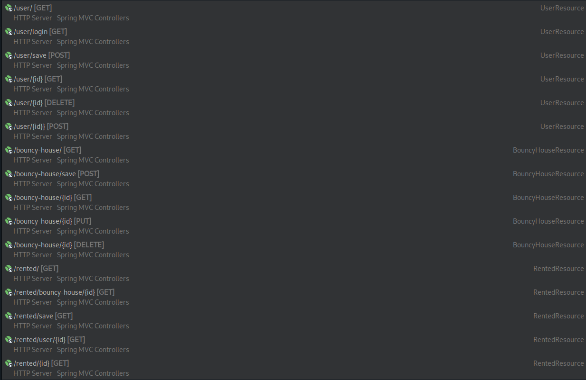

# App Backend

## Installation

    - Start your own `mysql.service` (ex. use [XAMPP](https://www.apachefriends.org/de/index.html))
    - Create a database and name it _fhdw_app_db_ or adjust the path in `src/main/resources/application.properties`
    - Run the project

    You should get an output like this
    ```
        17:25:10.554 [Thread-0] DEBUG org.springframework.boot.devtools.restart.classloader.RestartClassLoader - Created RestartClassLoader org.springframework.boot.devtools.restart.classloader.RestartClassLoader@3ffa323d

        .   ____          _            __ _ _
        /\\ / ___'_ __ _ _(_)_ __  __ _ \ \ \ \
        ( ( )\___ | '_ | '_| | '_ \/ _` | \ \ \ \
        \\/  ___)| |_)| | | | | || (_| |  ) ) ) )
        '  |____| .__|_| |_|_| |_\__, | / / / /
        =========|_|==============|___/=/_/_/_/
        :: Spring Boot ::                (v2.7.4)

        2022-10-16 17:25:10.740  INFO 1075572 --- [  restartedMain] c.f.appbackend.AppBackendApplication     : Starting AppBackendApplication using Java 18.0.2 on archlinux with PID 1075572 (/home/charlie/Projects/bouncy-house-renting/app-backend/target/classes started by charlie in /home/charlie/Projects/bouncy-house-renting/app-backend)
        2022-10-16 17:25:10.741  INFO 1075572 --- [  restartedMain] c.f.appbackend.AppBackendApplication     : No active profile set, falling back to 1 default profile: "default"
        2022-10-16 17:25:10.777  INFO 1075572 --- [  restartedMain] .e.DevToolsPropertyDefaultsPostProcessor : Devtools property defaults active! Set 'spring.devtools.add-properties' to 'false' to disable
        2022-10-16 17:25:10.778  INFO 1075572 --- [  restartedMain] .e.DevToolsPropertyDefaultsPostProcessor : For additional web related logging consider setting the 'logging.level.web' property to 'DEBUG'
        2022-10-16 17:25:11.063  INFO 1075572 --- [  restartedMain] .s.d.r.c.RepositoryConfigurationDelegate : Bootstrapping Spring Data JPA repositories in DEFAULT mode.
        2022-10-16 17:25:11.088  INFO 1075572 --- [  restartedMain] .s.d.r.c.RepositoryConfigurationDelegate : Finished Spring Data repository scanning in 20 ms. Found 3 JPA repository interfaces.
        2022-10-16 17:25:11.374  INFO 1075572 --- [  restartedMain] o.s.b.w.embedded.tomcat.TomcatWebServer  : Tomcat initialized with port(s): 8080 (http)
        2022-10-16 17:25:11.379  INFO 1075572 --- [  restartedMain] o.apache.catalina.core.StandardService   : Starting service [Tomcat]
        2022-10-16 17:25:11.379  INFO 1075572 --- [  restartedMain] org.apache.catalina.core.StandardEngine  : Starting Servlet engine: [Apache Tomcat/9.0.65]
        2022-10-16 17:25:11.406  INFO 1075572 --- [  restartedMain] o.a.c.c.C.[Tomcat].[localhost].[/]       : Initializing Spring embedded WebApplicationContext
        2022-10-16 17:25:11.406  INFO 1075572 --- [  restartedMain] w.s.c.ServletWebServerApplicationContext : Root WebApplicationContext: initialization completed in 628 ms
        2022-10-16 17:25:11.480  INFO 1075572 --- [  restartedMain] o.hibernate.jpa.internal.util.LogHelper  : HHH000204: Processing PersistenceUnitInfo [name: default]
        2022-10-16 17:25:11.499  INFO 1075572 --- [  restartedMain] org.hibernate.Version                    : HHH000412: Hibernate ORM core version 5.6.11.Final
        2022-10-16 17:25:11.570  INFO 1075572 --- [  restartedMain] o.hibernate.annotations.common.Version   : HCANN000001: Hibernate Commons Annotations {5.1.2.Final}
        2022-10-16 17:25:11.621  INFO 1075572 --- [  restartedMain] com.zaxxer.hikari.HikariDataSource       : HikariPool-1 - Starting...
        2022-10-16 17:25:11.702  INFO 1075572 --- [  restartedMain] com.zaxxer.hikari.HikariDataSource       : HikariPool-1 - Start completed.
        2022-10-16 17:25:11.716  INFO 1075572 --- [  restartedMain] org.hibernate.dialect.Dialect            : HHH000400: Using dialect: org.hibernate.dialect.MySQL55Dialect
        2022-10-16 17:25:12.009  INFO 1075572 --- [  restartedMain] o.h.e.t.j.p.i.JtaPlatformInitiator       : HHH000490: Using JtaPlatform implementation: [org.hibernate.engine.transaction.jta.platform.internal.NoJtaPlatform]
        2022-10-16 17:25:12.012  INFO 1075572 --- [  restartedMain] j.LocalContainerEntityManagerFactoryBean : Initialized JPA EntityManagerFactory for persistence unit 'default'
        2022-10-16 17:25:12.228  WARN 1075572 --- [  restartedMain] JpaBaseConfiguration$JpaWebConfiguration : spring.jpa.open-in-view is enabled by default. Therefore, database queries may be performed during view rendering. Explicitly configure spring.jpa.open-in-view to disable this warning
        2022-10-16 17:25:12.380  INFO 1075572 --- [  restartedMain] o.s.b.d.a.OptionalLiveReloadServer       : LiveReload server is running on port 35729
        2022-10-16 17:25:12.398  INFO 1075572 --- [  restartedMain] o.s.b.w.embedded.tomcat.TomcatWebServer  : Tomcat started on port(s): 8080 (http) with context path ''
        2022-10-16 17:25:12.405  INFO 1075572 --- [  restartedMain] c.f.appbackend.AppBackendApplication     : Started AppBackendApplication in 1.846 seconds (JVM running for 2.201)
    ```

    The Server will be available on _http://localhost:8080_

## Rest API Endpoints

The current endpoints are listed here


## Architecture